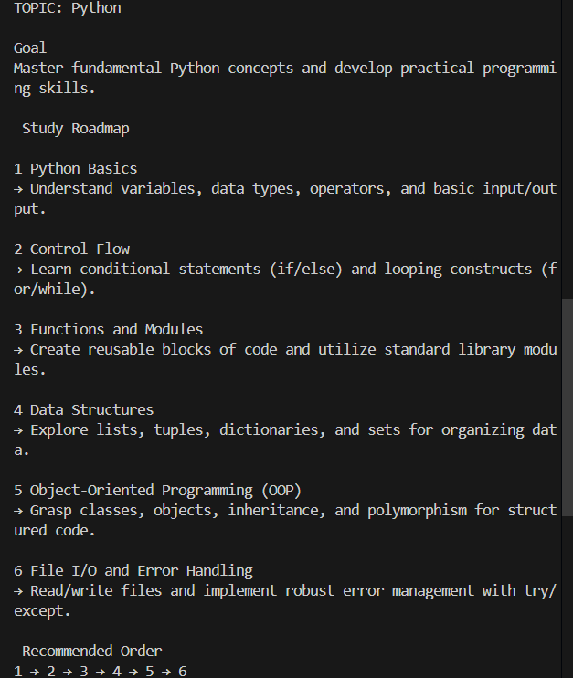
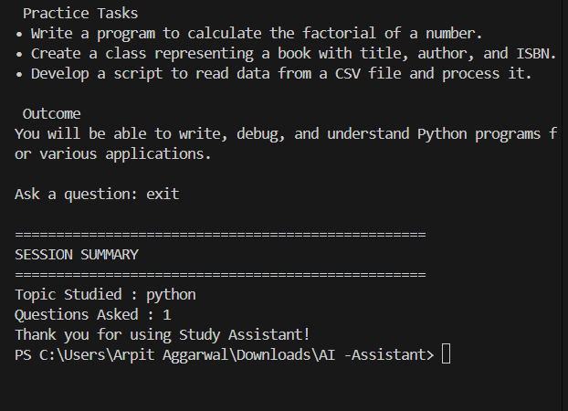

# AI-Powered Study Assistant CLI




## Overview

**AI-Powered Study Assistant CLI** is a command-line application powered by the **Gemini API** that helps students learn any subject through structured study roadmaps and interactive conversations.

The application uses **prompt engineering techniques** to generate organized learning paths, explain concepts clearly, and answer follow-up questions while maintaining conversational context.

---

## Features

### Topic-Based Study Roadmap

* Accepts any study topic from the user.
* Generates a structured learning roadmap.
* Organizes subtopics in a recommended learning sequence.
* Provides concise explanations for each topic.

### Interactive Learning Session

* Ask follow-up questions about any topic.
* Maintains conversation context throughout the session.
* Supports continuous learning and concept clarification.

### Engineered System Prompt

* Assigns the AI the role of an Expert Study Mentor and Curriculum Designer.
* Enforces a consistent roadmap format.
* Controls response structure and length.
* Improves output quality through explicit instructions and constraints.

### Session Summary

* End the session using `quit` or `exit`.
* Displays:
  * Studied topic
  * Total questions asked during the session

---

## Technologies Used

* Python 3
* Gemini API (`gemini-2.0-flash`)
* Google GenAI SDK (`google-genai`)
* Python Dotenv (`python-dotenv`)

---

## Installation

### Clone the Repository

```bash
git clone <your-github-repository-url>
cd AI-Study-Assistant